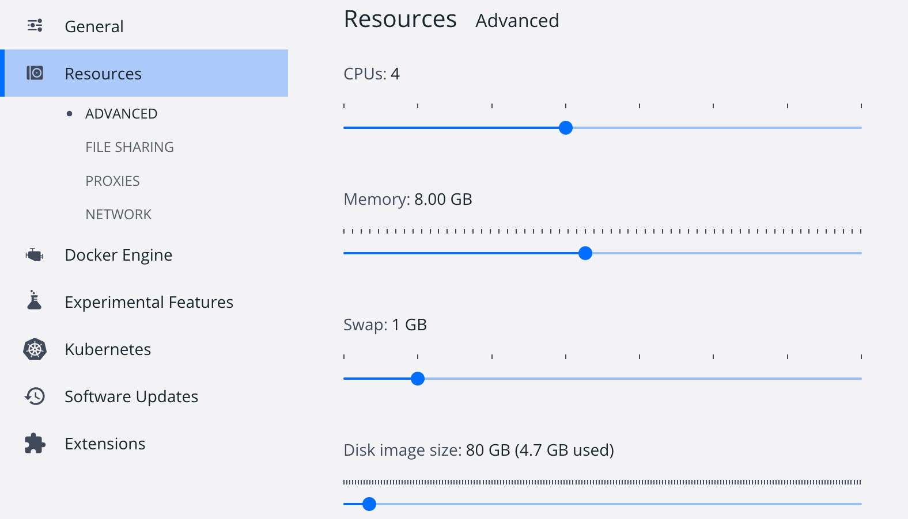
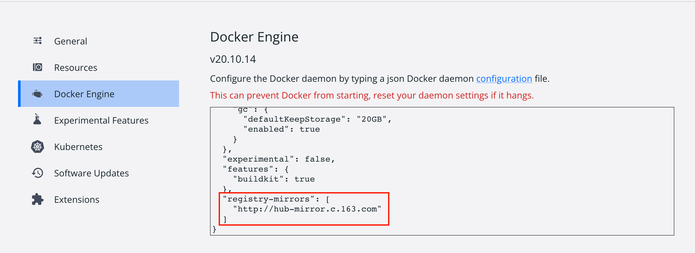
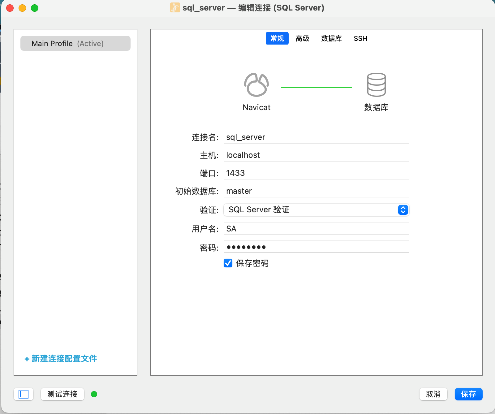

# Mac 安装 SQL Server

<!--more-->

### 前言

由于最近学习需要使用到 SQL Server 数据库，但我本人使用的操作系统是 Mac ，众所周知， SQL Server 是微软旗下的关系型数据库（具体有关SQL Server优点自行去微软官方查看👀 [Microsoft - SQL Server | Microsoft Docs](https://docs.microsoft.com/zh-cn/sql/?view=sql-server-ver16) ），所以微软肯定更加亲近自己的亲儿子 Windows 操作系统，以至于到现在 SQL Server 并不支持 Mac，那怎么办呢？总不能安装虚拟机使用吧，对于我们如此珍惜内存使用的程序猿那是不可能的:joy:，经过我查阅资料，我发现微软当前支持 Ubuntu 16.04，和 RHEL 7.2（红帽子企业版 Linux ），既然支持 Linux 那就好办了，我们可以使用Docker:thinking:应用去虚拟化实例。

### Docker 介绍

Docker 是一个开源的应用容器引擎，基于 Go 语言 并遵从 Apache2.0 协议开源。

Docker 可以让开发者打包他们的应用以及依赖包到一个轻量级、可移植的容器中，然后发布到任何流行的 Linux 机器上，也可以实现虚拟化。容器是完全使用沙箱机制，相互之间不会有任何接口（类似 iPhone 的 app）,更重要的是容器性能开销极低。

Docker 最好的一点在于你需要什么环境就可以下载仅拥有该环境的 Linux 系统，即缩小了使用的体积，也拥有了需要使用的环境，轻便又高效。

### Mac 安装 Docker

- Docker 官网手动安装 [Docker](https://docker.p2hp.com/)
- HomeBrew 托管安装 `brew cask install docker`

对于能偷懒就偷懒的我来说:sunglasses:，肯定选择后者一条命令解决了，官网安装下载还需要去寻找点击下载，对于程序猿来说多不优雅呀:nerd_face:，想要了解 [macOS（或 Linux）缺失的软件包的管理器 — Homebrew](https://brew.sh/index_zh-cn) 的可以自行去了解一下，真是可以大大提高效率，让你安装程序变得如此优雅。

```text
==> Downloading https://download.docker.com/mac/stable/42716/Docker.dmg
######################################################################## 100.0%
==> Verifying SHA-256 checksum for Cask 'docker'.
==> Installing Cask docker
==> Moving App 'Docker.app' to '/Applications/Docker.app'.
   docker was successfully installed!
```

显示 `successfully` 便已经成功下载

### Docker 配置并拉取容器镜像

- 基本环境配置

根据自己电脑相应配置，自己分配Docker占用资源大小，内存一定要大于2G，我记得好像SQL Server最基本要保证内存2G才能成功启动（以下是我的Docker资源分配配置）。



<br>

<br>

<br>

- 镜像加速

鉴于国内网络问题，后续拉取 Docker 镜像十分缓慢，我们可以需要配置加速器来解决，我使用的是网易的镜像地址：`http://hub-mirror.c.163.com`。



<br>

<br>

<br>

配置完成后重启 Docker 应用，打开 Terminal 输入 `docker info` 查看配置是否成功。

```bash
docker info
....
 Registry Mirrors:
  http://hub-mirror.c.163.com/
 Live Restore Enabled: false
 Product License: Community Engine
```

<br>

<br>

<br>

- 拉取并运行 SQL Server 容器镜像

拉取并运行 SQL Server 容器映像，参考了[Docker: Install containers for SQL Server on Linux - SQL Server | Microsoft Docs](https://docs.microsoft.com/zh-cn/sql/linux/quickstart-install-connect-docker?view=sql-server-linux-2017&pivots=cs1-bash#pullandrun2017)

从 Microsoft 容器注册表中拉取 `SQL Server 2017 Linux` 容器映像，打开我们的终端，输入命令：

```bash
sudo docker pull mcr.microsoft.com/mssql/server:2017-latest
```

这里会将sql server for linux docker下载到我们计算机上。

<br>

<br>

<br>

- 使用 Docker 运行容器镜像

要使用 Docker 运行容器映像，可以从 `Terminal` (Linux/macOS) 使用以下命令。(也就是终端)。

```bash
sudo docker run -e "ACCEPT_EULA=Y" -e "SA_PASSWORD=<YourStrong@Passw0rd>" \
   -p 1433:1433 --name sqlserver \
   -d mcr.microsoft.com/mssql/server:2017-latest
```

<br>

**备注**: 密码应符合 SQL Server 默认密码策略，否则容器无法设置 SQL Server，将停止工作。 默认情况下，密码的长度必须至少为 8 个字符，并且必须包含以下四种字符中的三种：大写字母、小写字母、十进制数字和符号。 你可以通过执行 docker logs 命令检查错误日志。

<br>

**参数说明:**  

`-e "ACCEPT_EULA=Y"` 将 ACCEPT_EULA 变量设置为任意值，以确认接受最终用户许可协议。 SQL Server 映像的必须设置。

`"SA_PASSWORD=<YourStrong@Passw0rd>"` 指定至少包含 8 个字符且符合 SQL Server 密码要求的强密码。 SQL Server 映像的必需设置。

`-p 1433:1433` 将主机环境中的 TCP 端口（第一个值）映射到容器中的 TCP 端口（第二个值）。 在此示例中，SQL Server 侦听容器中的 TCP 1433，并对主机上的端口 1433 公开。 

`name sqlserver` 为容器指定一个自定义名称，而不是使用随机生成的名称。 如果运行多个容器，则无法重复使用相同的名称。

`mcr.microsoft.com/mssql/server:2017-latest` SQL Server 2017 Linux 容器映像

<br>

<br>

<br>

- 查看 Docker 容器

要查看 Docker 容器，请在 Terminal 中使用 docker ps 命令。

```bash
sudo docker ps -a
```

<br>

显示结果如下：

```bash
CONTAINER ID        IMAGE                                        COMMAND                  CREATED             STATUS                     PORTS               NAMES
78c2deca0bd6        mcr.microsoft.com/mssql/server:2017-latest   "/opt/mssql/bin/nonr…"   30 minutes ago      Exited (0) 2 minutes ago                       sqlserver
```

如果“状态”列显示“正常运行”，则 SQL Server 将在容器中运行，并侦听“端口”列中指定的端口（我现在是关闭状态，可以使用 `docker start CONTAINER ID` 重新启动 ） 。

<br>

<br>

<br>

- 更改 `SA` 密码

SA 帐户是安装过程中在 SQL Server 实例上创建的系统管理员。 创建 SQL Server 容器后，通过在容器中运行 `echo $SA_PASSWORD`，可发现指定的 `SA_PASSWORD` 环境变量。 出于安全考虑，请考虑更改 SA 密码。

1. 选择 SA 用户要使用的强密码。 
2. 使用 docker exec 运行sqlcmd ，以使用 `Transact-SQL` 更改密码。 在下面的示例中，将旧密码 `<YourStrong!Passw0rd>`和新密码 `<YourNewStrong!Passw0rd>` 替换为你自己的密码值。

```bash
sudo docker exec -it sqlserver /opt/mssql-tools/bin/sqlcmd \
   -S localhost -U SA -P "<YourStrong@Passw0rd>" \
   -Q 'ALTER LOGIN SA WITH PASSWORD="<YourNewStrong@Passw0rd>"'
```

<br>

<br>

<br>

- 连接 SQL Server

下列步骤在容器内部使用 `SQL Server` 命令行工具 `sqlcmd` 来连接 `SQL Server`。

使用 `docker exec -it` 命令在运行的容器内部启动交互式 `Bash Shell`。 在下面的示例中，`sqlserver` 是在创建容器时由 --name 参数指定的名称。

```bash
sudo docker exec -it sql1 "bash"
```

<br>

在容器内部使用 sqlcmd 进行本地连接。 默认情况下，sqlcmd 不在路径之中，因此需要指定完整路径。

```bash
/opt/mssql-tools/bin/sqlcmd -S localhost -U SA -P "<YourNewStrong@Passw0rd>"
```

**如果成功，应会显示 sqlcmd 命令提示符：1>**

<br>

<br>

<br>

### 利用`Navicat`可视化工具连接Sql Server

下载 `navicat` 应用选择SQL Server服务，输入`连接名`、`主机`、`用户名`、`密码`进行连接。



<br>

**提示：**

密码一定不要填错，如果密码填错，会出现以下错误(一定要学会去Docker里面查看LOG):


<br>

**注意：**

`创建sa账号时候的密码的左右<>两个尖括号也是属于密码的`

我就是在实际操作中犯了如此低级的错误，望以鉴！


### 总结

**满怀希望就会所向披靡，因为深海不会因为一杯沸水而加温!**

<br>

以上就是本次分享的在Mac上如何使用 SQL Server 的详细教程,我们一起讨论！如果哪里有写的不好的地方，还希望大家提出来，在下方评论区留言，我加以修正！
